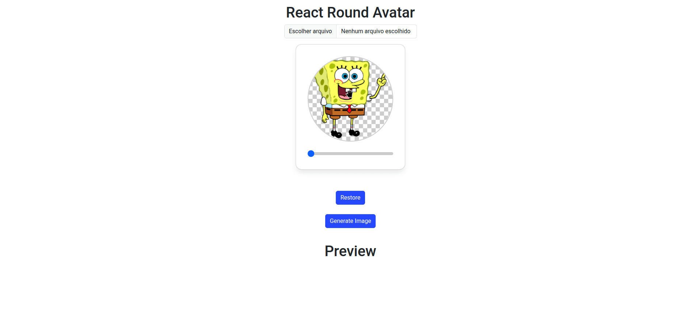

# React Round Avatar

React Round Avatar is a lightweight and customizable React component for editing and cropping round/circular avatars. It supports zoom, crop, and drag functionalities, making it ideal for profile picture editors in web applications.

<div style="width: 80%; margin: 0 auto;">

</div>

## Features

- Crop and zoom images in a circular area
- Drag to reposition the image
- Restore original image
- Easy integration with React projects
- TypeScript support

## Installation

```sh
npm install react-round-avatar
# or
pnpm add react-round-avatar
```

## Usage

```tsx
import React, { useRef, useState } from 'react';
import { RoundAvatarEditor } from 'react-round-avatar';

function App() {
  const [file, setFile] = useState<File | string>('https://example.com/avatar.png');
  const editorRef = useRef(null);

  return (
    <RoundAvatarEditor
      ref={editorRef}
      width={200}
      height={200}
      image={file}
      crossOrigin="anonymous"
      restoreButton={{
        text: 'Restore',
        className: 'restore-btn',
        show: true,
        onClick: () => alert('Restored!'),
        disabled: false,
      }}
      inputRange={{
        clasName: 'input-range',
        disabled: false,
        show: true,
      }}
      className="avatar-editor"
      onMouseMove={() => console.log('Mouse moving')}
      onMouseUp={() => console.log('Mouse up')}
      onImageReady={(img) => console.log('Image ready', img)}
      onPositionChange={(offset) => console.log('Position changed', offset)}
      onScaleChange={(scale) => console.log('Scale changed', scale)}
      onError={(error) => console.error('Error loading image', error)}
    />
  );
}

export default App;
```

## API

### Props

| Name               | Type                                     | Description                        |
| ------------------ | ---------------------------------------- | ---------------------------------- |
| `width`            | `number`                                 | Canvas width                       |
| `height`           | `number`                                 | Canvas height                      |
| `image`            | `string \| File`                         | Image source (file or URL)         |
| `crossOrigin`      | `'' \| 'anonymous' \| 'use-credentials'` | Cross-origin attribute for image   |
| `restoreButton`    | `RestoreButton`                          | Restore button options             |
| `inputRange`       | `InputRange`                             | Input range options                |
| `className`        | `string`                                 | Custom class name for editor       |
| `onMouseMove`      | `() => void`                             | Mouse move event handler           |
| `onMouseUp`        | `() => void`                             | Mouse up event handler             |
| `onImageReady`     | `(image: HTMLImageElement) => void`      | Called when image is loaded        |
| `onPositionChange` | `(offset: Offset) => void`               | Called when image position changes |
| `onScaleChange`    | `(scale: number) => void`                | Called when zoom/scale changes     |
| `onError`          | `(error: ErrorLoadImage) => void`        | Error callback                     |

#### RestoreButton

| Name        | Type         | Description             |
| ----------- | ------------ | ----------------------- |
| `text`      | `string`     | Button text             |
| `className` | `string`     | Custom class for button |
| `show`      | `boolean`    | Show/hide button        |
| `onClick`   | `() => void` | Click handler           |
| `disabled`  | `boolean`    | Disable button          |

#### InputRange

| Name       | Type      | Description                  |
| ---------- | --------- | ---------------------------- |
| `clasName` | `string`  | Custom class for input range |
| `disabled` | `boolean` | Disable input range          |
| `show`     | `boolean` | Show/hide input              |

#### ErrorLoadImage

| Type                        | Description             |
| --------------------------- | ----------------------- |
| `string`                    | Error message           |
| `Event`                     | DOM event error         |
| `ProgressEvent<FileReader>` | FileReader error event  |
| `Error`                     | JavaScript Error object |

### Methods

- `getImage()`: Returns the current cropped image as a data URL.
- `restoreImage()`: Restores the image to its initial state.

## License

MIT
